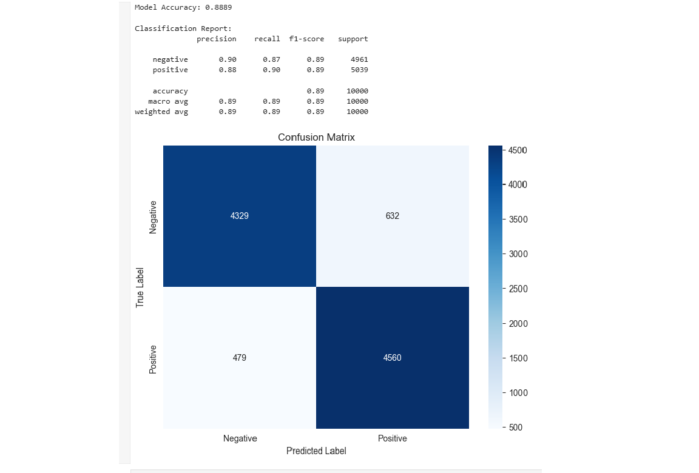

Sentiment Analysis of IMDB Movie Reviews 🎬

This project is a classic Natural Language Processing (NLP) task that classifies movie reviews from the IMDB dataset as either positive or negative. The entire workflow, from data exploration to model evaluation, is contained within a Jupyter Notebook.

🎯 Project Goal

The objective is to build and evaluate a machine learning model that can accurately predict the sentiment of a movie review. This demonstrates a fundamental understanding of text data preprocessing, feature extraction, and classification algorithms.

📊 Dataset

The project uses the "IMDB Dataset of 50K Movie Reviews," which is a clean and balanced dataset perfect for binary sentiment classification. It contains 50,000 reviews, with 25,000 labeled as positive and 25,000 as negative.

You can download the dataset from Kaggle: IMDB Dataset of 50K Movie Reviews

⚙️ Project Workflow

Data Loading & Exploration: The IMDB Dataset.csv is loaded into a pandas DataFrame. Initial exploratory data analysis (EDA) is performed to understand the data's structure and balance.

Data Visualization: The distribution of sentiments (positive vs. negative) is visualized using seaborn and matplotlib to confirm the dataset is balanced.

Data Preprocessing & Feature Extraction:

The text data (reviews) is converted into numerical features that the model can understand.

This is achieved using the TF-IDF (Term Frequency-Inverse Document Frequency) technique, which reflects how important a word is to a document in the collection. Common English "stop words" are removed.

Model Training:

The dataset is split into a training set (80%) and a testing set (20%).

A Logistic Regression classifier is trained on the TF-IDF vectors of the training data.

Model Evaluation:

The trained model's performance is evaluated on the unseen test set.

Key metrics like accuracy and a detailed classification report (including precision, recall, and F1-score) are calculated.

A Confusion Matrix is plotted to visualize the model's performance in distinguishing between the two classes.

📈 Results

The final model achieved an accuracy of approximately 89% on the test set, demonstrating its effectiveness in classifying movie review sentiment. The confusion matrix provides a clear view of the model's true positive and true negative predictions.

🛠️ Technologies Used

Python

Jupyter Notebook

Pandas: For data manipulation and loading.

Scikit-learn: For machine learning tasks (TF-IDF, train-test split, Logistic Regression, and evaluation metrics).

Matplotlib & Seaborn: For data visualization.

🚀 How to Run this Project

Clone the repository:

git clone [https://github.com/YourUsername/YourRepositoryName.git](https://github.com/YourUsername/YourRepositoryName.git)
cd YourRepositoryName

Install the required libraries:

pip install pandas scikit-learn matplotlib seaborn jupyterlab

Download the dataset:

Download the IMDB Dataset.csv from the Kaggle link above.

Place the .csv file in the root directory of the project.

Launch Jupyter Notebook:

jupyter notebook

Open the .ipynb file and run the cells sequentially.
